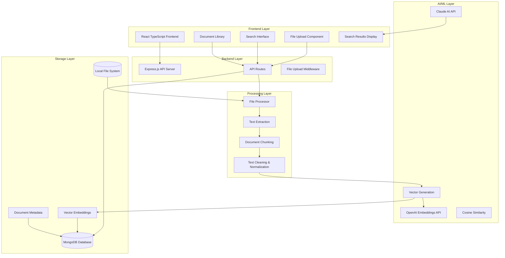
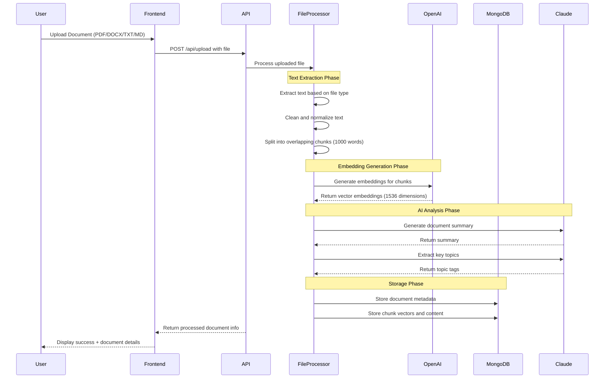
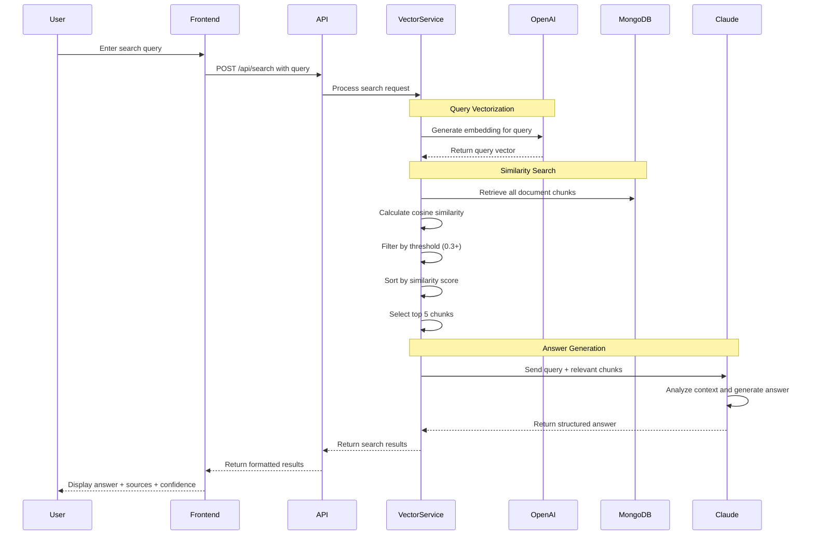
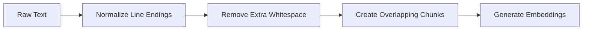
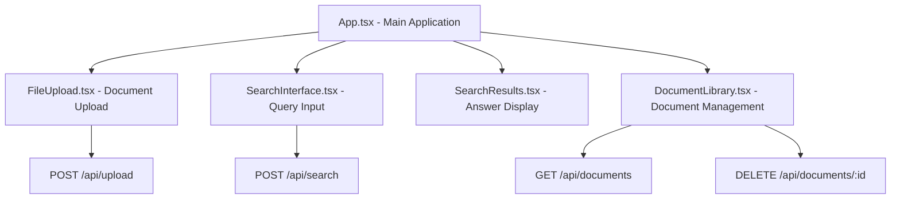

# Personal Knowledge Base with AI Search

A full-stack application that allows you to upload documents (PDF, DOCX, TXT, MD) and search through them using AI-powered natural language queries.

## Features

- 📄 **Document Upload**: Support for PDF, DOCX, TXT, and Markdown files
- 🔍 **AI-Powered Search**: Ask questions in natural language and get intelligent answers
- 🧠 **Smart Chunking**: Automatically breaks documents into searchable chunks
- 📊 **Document Management**: View, organize, and delete your uploaded documents
- 🎯 **Relevance Scoring**: Shows confidence levels and source relevance
- ⚡ **Fast Vector Search**: Efficient similarity search using embeddings

## Tech Stack

**Frontend:**
- React 18 with TypeScript
- Tailwind CSS for styling
- React Dropzone for file uploads
- Lucide React for icons

**Backend:**
- Node.js with Express and TypeScript
- Claude API for question answering
- OpenAI API for embeddings generation
- In-memory vector storage (easily replaceable with Pinecone/Chroma)
- PDF.js and Mammoth for document processing

## Prerequisites

- Node.js 16+ installed
- Anthropic API key (Claude)
- OpenAI API key (for embeddings)

## Quick Start

### 1. Clone and Set Up Project Structure

Create the following directory structure:

```
personal-knowledge-base/
├── frontend/
├── backend/
├── .env.example
├── .gitignore
└── README.md
```

### 2. Backend Setup

```bash
cd backend
npm init -y
npm install express cors dotenv multer pdf-parse mammoth @anthropic-ai/sdk openai chromadb pg bcryptjs jsonwebtoken uuid fs-extra
npm install -D @types/express @types/cors @types/multer @types/node @types/pg @types/bcryptjs @types/jsonwebtoken @types/uuid @types/fs-extra typescript ts-node-dev jest @types/jest
```

Create your `.env` file:
```bash
cp ../.env.example .env
```

Add your API keys to `.env`:
```
ANTHROPIC_API_KEY=your_anthropic_api_key_here
OPENAI_API_KEY=your_openai_api_key_here
PORT=3001
NODE_ENV=development
```

### 3. Frontend Setup

```bash
cd ../frontend
npx create-react-app . --template typescript
npm install tailwindcss autoprefixer postcss @tailwindcss/typography axios react-dropzone pdfjs-dist mammoth lucide-react
npm install -D @types/pdfjs-dist
```

Initialize Tailwind:
```bash
npx tailwindcss init -p
```

### 4. Add All the Code Files

Copy all the provided code into the respective files according to the file structure.

### 5. Start the Application

Terminal 1 (Backend):
```bash
cd backend
npm run dev
```

Terminal 2 (Frontend):
```bash
cd frontend
npm start
```

The application will be available at:
- Frontend: http://localhost:3000
- Backend: http://localhost:3001

## Usage

1. **Upload Documents**: Go to the Upload tab and drag & drop your PDF, DOCX, TXT, or MD files
2. **Search**: Use the Search tab to ask questions about your documents in natural language
3. **Manage**: View and manage your uploaded documents in the Library tab

## Example Queries

- "What are the main findings in the research papers?"
- "Summarize the key points about machine learning"
- "What does the document say about data privacy?"
- "Find information about project timelines"
- "What are the recommendations mentioned?"

## Production Deployment

For production use, consider:

1. **Database**: Replace the in-memory storage with PostgreSQL or MongoDB
2. **Vector Store**: Use Pinecone, Chroma, or Weaviate for production vector storage
3. **File Storage**: Use AWS S3 or similar for file storage
4. **Authentication**: Add user authentication and authorization
5. **Rate Limiting**: Implement API rate limiting
6. **Monitoring**: Add logging and monitoring
7. **HTTPS**: Use HTTPS in production

## Environment Variables

```env
# Required
ANTHROPIC_API_KEY=your_anthropic_api_key_here
OPENAI_API_KEY=your_openai_api_key_here

# Optional
PORT=3001
NODE_ENV=development
MAX_FILE_SIZE=52428800  # 50MB
UPLOAD_DIR=./uploads

# Production options
DATABASE_URL=postgresql://...
PINECONE_API_KEY=your_pinecone_key
CHROMA_HOST=localhost
CHROMA_PORT=8000
```

## API Endpoints

- `POST /api/upload` - Upload and process documents
- `POST /api/search` - Search through documents
- `GET /api/documents` - Get all documents
- `GET /api/documents/:id` - Get specific document
- `DELETE /api/documents/:id` - Delete document
- `GET /api/documents/stats` - Get statistics
- `GET /api/health` - Health check

## Contributing

1. Fork the repository
2. Create a feature branch
3. Make your changes
4. Add tests if needed
5. Submit a pull request

# Project Explained

## Overview

The Personal Knowledge Base is a sophisticated AI-powered document management and search system that leverages advanced machine learning techniques to provide intelligent document analysis and natural language query capabilities. The system combines cutting-edge AI services (Claude and OpenAI) with modern web technologies to create a seamless knowledge extraction and retrieval experience.

## System Architecture



## Detailed System Flow

### 1. Document Upload and Processing Pipeline



### 2. Search and Retrieval System



## Core Technologies and Algorithms

### 1. Text Extraction and Processing

**File Format Support:**
- **PDF**: Uses `pdf-parse` library for text extraction from PDF documents
- **DOCX**: Utilizes `mammoth` library to extract raw text from Word documents
- **TXT/MD**: Direct file system reading with UTF-8 encoding

**Text Processing Pipeline:**


**Chunking Algorithm:**
- **Chunk Size**: 1000 words per chunk (optimized for context window)
- **Overlap**: 100 words overlap between consecutive chunks
- **Strategy**: Sliding window approach to prevent context loss
- **Benefits**: Ensures search queries can find relevant information even when it spans chunk boundaries

### 2. Vector Embeddings and Machine Learning

**OpenAI Text Embeddings:**
- **Model**: `text-embedding-3-small` (1536 dimensions)
- **Purpose**: Convert text into high-dimensional vectors for semantic similarity
- **Batch Processing**: Processes multiple chunks simultaneously for efficiency
- **Encoding**: Float32 format for optimal precision

**Vector Similarity Algorithm:**
```javascript
// Cosine Similarity Implementation
function cosineSimilarity(vectorA, vectorB) {
    let dotProduct = 0;
    let normA = 0;
    let normB = 0;
    
    for (let i = 0; i < vectorA.length; i++) {
        dotProduct += vectorA[i] * vectorB[i];
        normA += vectorA[i] * vectorA[i];
        normB += vectorB[i] * vectorB[i];
    }
    
    return dotProduct / (Math.sqrt(normA) * Math.sqrt(normB));
}
```

### 3. Claude AI Integration

**Natural Language Processing:**
- **Model**: `claude-3-haiku-20240307`
- **Primary Functions**:
  - Document summarization (2-3 sentence summaries)
  - Topic extraction (5-10 key topics per document)
  - Question answering based on relevant chunks
- **Temperature**: 0.3 (balanced creativity and consistency)
- **Max Tokens**: 1000 for answers, 300 for summaries

**Prompt Engineering Strategy:**
```
System Role: Helpful assistant that answers based on provided context
Context: [Relevant document chunks with source attribution]
Question: [User's natural language query]
Instructions:
1. Answer based ONLY on provided context
2. Cite sources by document names
3. Indicate if information is insufficient
4. Mention conflicting information when present
```

## Data Storage and Management

### MongoDB Schema Design

**Document Metadata Collection:**
```javascript
{
  _id: ObjectId,
  id: "doc_timestamp_randomid",
  filename: "uploaded-file-name.pdf",
  originalName: "Original File Name.pdf",
  mimeType: "application/pdf",
  content: "Full extracted text content",
  summary: "AI-generated summary",
  topics: ["topic1", "topic2", ...],
  uploadedAt: ISODate,
  wordCount: 5420,
  chunkCount: 6
}
```

**Document Chunks Collection:**
```javascript
{
  _id: ObjectId,
  id: "vector_doc_timestamp_randomid_chunk_0",
  documentId: "doc_timestamp_randomid",
  documentName: "Original File Name.pdf",
  chunkId: "doc_timestamp_randomid_chunk_0",
  content: "Chunk text content...",
  chunkIndex: 0,
  startPosition: 0,
  endPosition: 1000,
  wordCount: 1000,
  embedding: [0.1, -0.2, 0.3, ...], // 1536-dimensional vector
  createdAt: ISODate
}
```

## Search Query Processing

### Query Analysis and Matching

**Search Algorithm Flow:**
1. **Query Preprocessing**: Clean and normalize user input
2. **Embedding Generation**: Convert query to vector using OpenAI
3. **Vector Search**: Calculate cosine similarity with all stored chunks
4. **Filtering**: Apply minimum similarity threshold (0.3)
5. **Ranking**: Sort results by similarity score (descending)
6. **Selection**: Choose top 5 most relevant chunks
7. **Context Preparation**: Format chunks with source attribution
8. **AI Processing**: Send to Claude for answer generation

**Confidence Scoring Algorithm:**
```javascript
function calculateConfidence(relevantChunks) {
    const avgSimilarity = chunks.reduce((sum, chunk) => 
        sum + chunk.similarity, 0) / chunks.length;
    const topSimilarity = Math.max(...chunks.map(chunk => 
        chunk.similarity));
    
    // Weighted combination: 30% average, 70% top similarity
    return Math.round((avgSimilarity * 0.3 + topSimilarity * 0.7) * 100);
}
```

## System Performance and Optimization

### Efficiency Measures

**Batch Processing:**
- Embeddings generated in batches to reduce API calls
- MongoDB operations use bulk inserts for better performance
- Parallel processing where possible

**Caching Strategy:**
- Document embeddings cached in database
- No need to regenerate vectors for existing documents
- Fast similarity calculations using pre-computed vectors

**Memory Management:**
- Streaming file processing for large documents
- Chunked processing to handle memory constraints
- Cleanup of temporary files after processing

### Error Handling and Resilience

**API Error Management:**
- Comprehensive error handling for OpenAI and Claude APIs
- Specific error messages for different failure scenarios
- Graceful degradation when services are unavailable

**Data Validation:**
- File type validation before processing
- Content length limits to prevent abuse
- Vector dimension consistency checks

## Frontend Architecture

### React Component Hierarchy



### State Management

**React State Flow:**
- Global state managed through React hooks (useState)
- Document list state synchronized with backend
- Search results state updated in real-time
- Loading states for better user experience

**User Interface Features:**
- Drag-and-drop file upload with visual feedback
- Real-time search with loading indicators
- Confidence scores and source citations
- Responsive design for various screen sizes

## Security and Best Practices

### API Security
- CORS configuration for cross-origin requests
- File type validation and size limits
- Request timeout handling for large uploads
- Environment variable protection for API keys

### Data Privacy
- Local file processing (no external file uploads)
- Secure API key management
- Option to clear all data for privacy compliance

## Scalability Considerations

### Current Architecture Limitations
- In-memory vector storage (suitable for development)
- Single-server deployment model
- Local file system storage

### Production Scaling Recommendations
- **Vector Database**: Migrate to Pinecone, Weaviate, or Qdrant
- **File Storage**: Use AWS S3 or Google Cloud Storage
- **Database**: Implement proper MongoDB clustering
- **Caching**: Add Redis for frequently accessed data
- **Load Balancing**: Implement horizontal scaling
- **Monitoring**: Add comprehensive logging and metrics

## Machine Learning Pipeline Summary

The system implements a Retrieval-Augmented Generation (RAG) architecture:

1. **Document Ingestion**: Files → Text Extraction → Chunking
2. **Embedding Generation**: Chunks → OpenAI API → Vector Embeddings
3. **Storage**: Vectors + Metadata → MongoDB
4. **Query Processing**: Question → Embedding → Similarity Search
5. **Context Retrieval**: Top Chunks → Context Preparation
6. **Answer Generation**: Context + Query → Claude AI → Natural Language Answer

This architecture ensures accurate, contextual responses based on the user's specific document corpus while maintaining high performance and scalability.

## License

MIT License - see LICENSE file for details