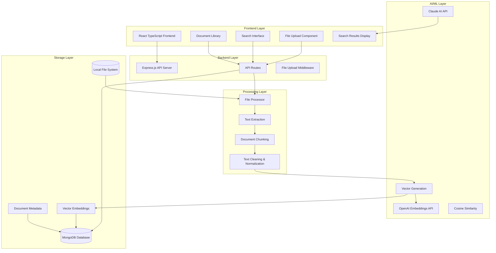
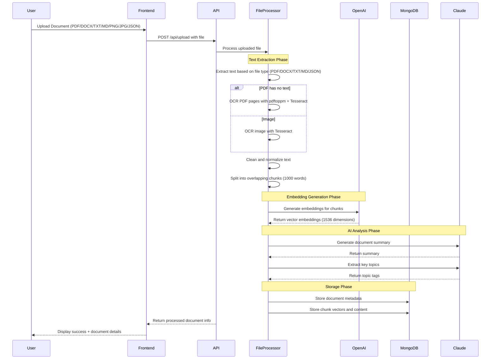
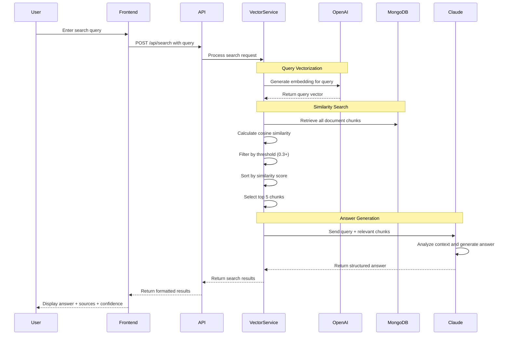
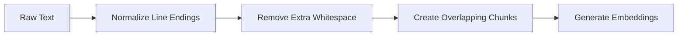
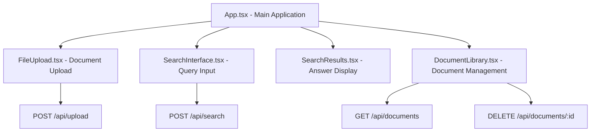
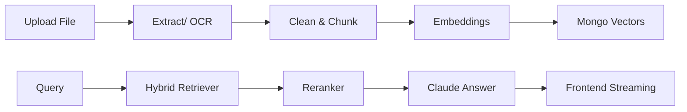
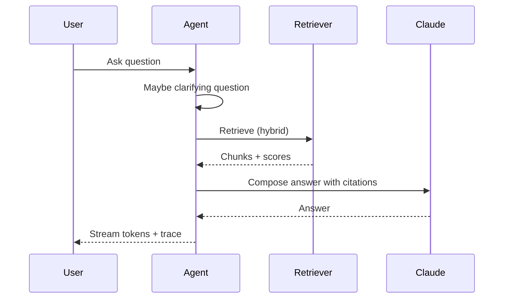
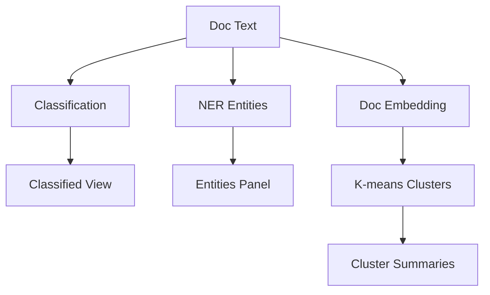
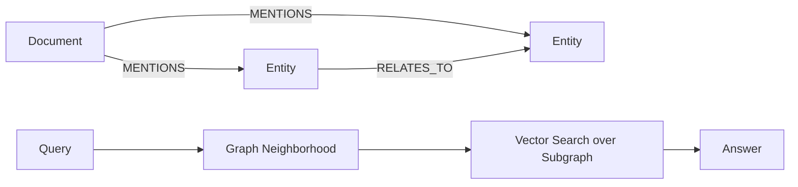
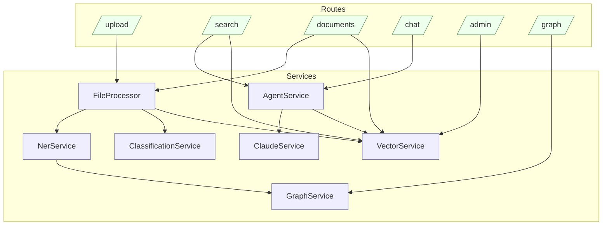

# Personal Knowledge Base with AI Search (Full RAG + Agent + KG + Multimodal)

An end-to-end, production-style RAG system that ingests and understands your files (PDF, DOCX, TXT, MD, PNG/JPG images, JSON), extracts structure (NER, classification), builds a Knowledge Graph, and answers questions with Agentic reasoning and Graph RAG. Includes hybrid retrieval, cross-encoder reranking, streaming answers, document management, clustering, classified views, entity explorer, and a chat agent with traces.

## Features (What this app does now)

- 📄 **Document Upload**: Support for PDF, DOCX, TXT, MD, PNG/JPG (OCR), JSON
- 🔍 **AI-Powered Search**: Ask questions in natural language and get intelligent answers
- 🧠 **Smart Chunking**: Automatically breaks documents into searchable chunks
- 📊 **Document Management**: View, organize, and delete your uploaded documents
- 🎯 **Relevance Scoring**: Shows confidence levels and source relevance
- ⚡ **Fast Vector Search**: Efficient similarity search using embeddings
- 🧩 **Hybrid Retrieval**: Keyword (textScore) + vector blending; optional reranking
- 🤝 **Agentic Search**: Chat agent with clarifying questions, streaming SSE, and traces
- 🧬 **Document Intelligence**: Classification (zero-shot + heuristics), NER (quick+LLM), entities panel, classified folders
- 🧭 **Clusters**: K-means over document embeddings, LLM cluster summaries
- 🕸️ **Knowledge Graph**: Entities and MENTIONS edges; Graph Explorer; groundwork for Graph RAG
- 🖼️ **Multimodal**: OCR for scanned PDFs and images; JSON parsing/flattening

## Tech Stack

**Frontend:**
- React 18 with TypeScript
- Tailwind CSS for styling
- React Dropzone for file uploads
- Lucide React for icons

**Backend:**
- Node.js with Express and TypeScript
- Claude API for question answering
- OpenAI API for embeddings generation
- MongoDB for metadata, vectors (embedded arrays), KG nodes/edges, and analytics
- Mammoth (DOCX), pdf-parse (PDF), Tesseract+Poppler (OCR), JSON flattening

## Prerequisites

- Node.js 16+ installed
- Anthropic API key (Claude)
- OpenAI API key (for embeddings)

## Quick Start

### 1. Clone and Set Up Project Structure

Create the following directory structure:

```
personal-knowledge-base/
├── frontend/
├── backend/
├── .env.example
├── .gitignore
└── README.md
```

### 2. Backend Setup

```bash
cd backend
npm init -y
npm install express cors dotenv multer pdf-parse mammoth @anthropic-ai/sdk openai chromadb pg bcryptjs jsonwebtoken uuid fs-extra
npm install -D @types/express @types/cors @types/multer @types/node @types/pg @types/bcryptjs @types/jsonwebtoken @types/uuid @types/fs-extra typescript ts-node-dev jest @types/jest
```

Create your `.env` file:
```bash
cp ../.env.example .env
```

Add your API keys to `.env`:
```
ANTHROPIC_API_KEY=your_anthropic_api_key_here
OPENAI_API_KEY=your_openai_api_key_here
PORT=3001
NODE_ENV=development
```

### 3. Frontend Setup

```bash
cd ../frontend
npx create-react-app . --template typescript
npm install tailwindcss autoprefixer postcss @tailwindcss/typography axios react-dropzone pdfjs-dist mammoth lucide-react
npm install -D @types/pdfjs-dist
```

Initialize Tailwind:
```bash
npx tailwindcss init -p
```

### 4. Add All the Code Files

Copy all the provided code into the respective files according to the file structure.

### 5. Start the Application

Terminal 1 (Backend):
```bash
cd backend
npm run dev
```

Terminal 2 (Frontend):
```bash
cd frontend
npm start
```

The application will be available at:
- Frontend: http://localhost:3000
- Backend: http://localhost:3001

## Usage

1. **Upload Documents**: Go to the Upload tab and drag & drop your PDF, DOCX, TXT, or MD files
2. **Search**: Use the Search tab to ask questions about your documents in natural language
3. **Manage**: View and manage your uploaded documents in the Library tab

## Example Queries

- "What are the main findings in the research papers?"
- "Summarize the key points about machine learning"
- "What does the document say about data privacy?"
- "Find information about project timelines"
- "What are the recommendations mentioned?"

## Production Deployment

For production use, consider:

1. **Database**: Replace the in-memory storage with PostgreSQL or MongoDB
2. **Vector Store**: Use Pinecone, Chroma, or Weaviate for production vector storage
3. **File Storage**: Use AWS S3 or similar for file storage
4. **Authentication**: Add user authentication and authorization
5. **Rate Limiting**: Implement API rate limiting
6. **Monitoring**: Add logging and monitoring
7. **HTTPS**: Use HTTPS in production

## Environment Variables

```env
# Required
ANTHROPIC_API_KEY=your_anthropic_api_key_here
OPENAI_API_KEY=your_openai_api_key_here

# Optional
PORT=3001
NODE_ENV=development
MAX_FILE_SIZE=52428800  # 50MB
UPLOAD_DIR=./uploads

# Production options
DATABASE_URL=postgresql://...
PINECONE_API_KEY=your_pinecone_key
CHROMA_HOST=localhost
CHROMA_PORT=8000
```

## API Endpoints

- `POST /api/upload` - Upload and process documents
- `POST /api/search` - Search through documents
- `GET /api/documents` - Get all documents
- `GET /api/documents/:id` - Get specific document
- `DELETE /api/documents/:id` - Delete document
- `GET /api/documents/stats` - Get statistics
- `GET /api/health` - Health check

## Contributing

1. Fork the repository
2. Create a feature branch
3. Make your changes
4. Add tests if needed
5. Submit a pull request

# Project Explained

## Overview

The Personal Knowledge Base is a sophisticated AI-powered document management and search system that leverages advanced machine learning techniques to provide intelligent document analysis and natural language query capabilities. The system combines cutting-edge AI services (Claude and OpenAI) with modern web technologies to create a seamless knowledge extraction and retrieval experience.

## System Architecture



## Detailed System Flow (Phase-by-Phase)

### Phase 1 — Core RAG: Upload → Chunk → Embeddings → Hybrid Search → Answer



### Phase 1 (continued) — Search and Retrieval System



### Phase 1 — Core Technologies and Algorithms

### 1. Text Extraction and Processing

**File Format Support:**
- **PDF**: Uses `pdf-parse` library for text extraction from PDF documents
- **DOCX**: Utilizes `mammoth` library to extract raw text from Word documents
- **TXT/MD**: Direct file system reading with UTF-8 encoding

**Text Processing Pipeline:**


**Chunking Algorithm:**
- **Chunk Size**: 1000 words per chunk (optimized for context window)
- **Overlap**: 100 words overlap between consecutive chunks
- **Strategy**: Sliding window approach to prevent context loss
- **Benefits**: Ensures search queries can find relevant information even when it spans chunk boundaries

### 2. Vector Embeddings and Machine Learning

**OpenAI Text Embeddings:**
- **Model**: `text-embedding-3-small` (1536 dimensions)
- **Purpose**: Convert text into high-dimensional vectors for semantic similarity
- **Batch Processing**: Processes multiple chunks simultaneously for efficiency
- **Encoding**: Float32 format for optimal precision

**Vector Similarity Algorithm:**
```javascript
// Cosine Similarity Implementation
function cosineSimilarity(vectorA, vectorB) {
    let dotProduct = 0;
    let normA = 0;
    let normB = 0;
    
    for (let i = 0; i < vectorA.length; i++) {
        dotProduct += vectorA[i] * vectorB[i];
        normA += vectorA[i] * vectorA[i];
        normB += vectorB[i] * vectorB[i];
    }
    
    return dotProduct / (Math.sqrt(normA) * Math.sqrt(normB));
}
```

### Claude AI Integration

**Natural Language Processing:**
- **Model**: `claude-3-haiku-20240307`
- **Primary Functions**:
  - Document summarization (2-3 sentence summaries)
  - Topic extraction (5-10 key topics per document)
  - Question answering based on relevant chunks
- **Temperature**: 0.3 (balanced creativity and consistency)
- **Max Tokens**: 1000 for answers, 300 for summaries

**Prompt Engineering Strategy:**
```
System Role: Helpful assistant that answers based on provided context
Context: [Relevant document chunks with source attribution]
Question: [User's natural language query]
Instructions:
1. Answer based ONLY on provided context
2. Cite sources by document names
3. Indicate if information is insufficient
4. Mention conflicting information when present
```

## Data Storage and Management

### MongoDB Schema Design

**Document Metadata Collection:**
```javascript
{
  _id: ObjectId,
  id: "doc_timestamp_randomid",
  filename: "uploaded-file-name.pdf",
  originalName: "Original File Name.pdf",
  mimeType: "application/pdf",
  content: "Full extracted text content",
  summary: "AI-generated summary",
  topics: ["topic1", "topic2", ...],
  uploadedAt: ISODate,
  wordCount: 5420,
  chunkCount: 6
}
```

**Document Chunks Collection:**
```javascript
{
  _id: ObjectId,
  id: "vector_doc_timestamp_randomid_chunk_0",
  documentId: "doc_timestamp_randomid",
  documentName: "Original File Name.pdf",
  chunkId: "doc_timestamp_randomid_chunk_0",
  content: "Chunk text content...",
  chunkIndex: 0,
  startPosition: 0,
  endPosition: 1000,
  wordCount: 1000,
  embedding: [0.1, -0.2, 0.3, ...], // 1536-dimensional vector
  createdAt: ISODate
}
```

## Search Query Processing (Phase 1)

### Query Analysis and Matching

**Search Algorithm Flow:**
1. **Query Preprocessing**: Clean and normalize user input
2. **Embedding Generation**: Convert query to vector using OpenAI
3. **Vector Search**: Calculate cosine similarity with all stored chunks
4. **Filtering**: Apply minimum similarity threshold (0.3)
5. **Ranking**: Sort results by similarity score (descending)
6. **Selection**: Choose top 5 most relevant chunks
7. **Context Preparation**: Format chunks with source attribution
8. **AI Processing**: Send to Claude for answer generation

**Confidence Scoring Algorithm:**
```javascript
function calculateConfidence(relevantChunks) {
    const avgSimilarity = chunks.reduce((sum, chunk) => 
        sum + chunk.similarity, 0) / chunks.length;
    const topSimilarity = Math.max(...chunks.map(chunk => 
        chunk.similarity));
    
    // Weighted combination: 30% average, 70% top similarity
    return Math.round((avgSimilarity * 0.3 + topSimilarity * 0.7) * 100);
}
```

## System Performance and Optimization

### Efficiency Measures

**Batch Processing:**
- Embeddings generated in batches to reduce API calls
- MongoDB operations use bulk inserts for better performance
- Parallel processing where possible

**Caching Strategy:**
- Document embeddings cached in database
- No need to regenerate vectors for existing documents
- Fast similarity calculations using pre-computed vectors

**Memory Management:**
- Streaming file processing for large documents
- Chunked processing to handle memory constraints
- Cleanup of temporary files after processing

### Error Handling and Resilience

**API Error Management:**
- Comprehensive error handling for OpenAI and Claude APIs
- Specific error messages for different failure scenarios
- Graceful degradation when services are unavailable

**Data Validation:**
- File type validation before processing
- Content length limits to prevent abuse
- Vector dimension consistency checks

## Frontend Architecture

### React Component Hierarchy



### State Management

**React State Flow:**
- Global state managed through React hooks (useState)
- Document list state synchronized with backend
- Search results state updated in real-time
- Loading states for better user experience

**User Interface Features:**
- Drag-and-drop file upload with visual feedback
- Real-time search with loading indicators
- Confidence scores and source citations
- Responsive design for various screen sizes

## Security and Best Practices

### API Security
- CORS configuration for cross-origin requests
- File type validation and size limits
- Request timeout handling for large uploads
- Environment variable protection for API keys

### Data Privacy
- Local file processing (no external file uploads)
- Secure API key management
- Option to clear all data for privacy compliance

## Scalability Considerations

### Current Architecture Limitations
- In-memory vector storage (suitable for development)
- Single-server deployment model
- Local file system storage

### Production Scaling Recommendations
- **Vector Database**: Migrate to Pinecone, Weaviate, or Qdrant
- **File Storage**: Use AWS S3 or Google Cloud Storage
- **Database**: Implement proper MongoDB clustering
- **Caching**: Add Redis for frequently accessed data
- **Load Balancing**: Implement horizontal scaling
- **Monitoring**: Add comprehensive logging and metrics

## Machine Learning Pipeline Summary

The system implements a Retrieval-Augmented Generation (RAG) architecture:

1. **Document Ingestion**: Files → Text Extraction → Chunking
2. **Embedding Generation**: Chunks → OpenAI API → Vector Embeddings
3. **Storage**: Vectors + Metadata → MongoDB
4. **Query Processing**: Question → Embedding → Similarity Search
5. **Context Retrieval**: Top Chunks → Context Preparation
6. **Answer Generation**: Context + Query → Claude AI → Natural Language Answer

This architecture ensures accurate, contextual responses based on the user's specific document corpus while maintaining high performance and scalability.

---

# Phases Implemented

## Phase 1 — Core RAG

- Upload: PDF/DOCX/TXT/MD/JSON/Images → extraction (OCR fallback) → clean → chunk → embeddings
- Hybrid search: text index + vector, blending and optional reranking
- Claude answers with streaming SSE (chat and search), citations, and confidence



### Deep‑dive: What happens in Phase 1

- Upload & Extraction
  - Frontend accepts PDF/DOCX/TXT/MD/PNG/JPG/JSON. The file is sent to `POST /api/upload`.
  - `FileProcessor` extracts text:
    - PDF: `pdf-parse`; if empty → OCR fallback: `pdftoppm` → images → `tesseract`.
    - DOCX: `mammoth.extractRawText`.
    - TXT/MD: file read.
    - JSON: parsed and flattened into readable text lines.
  - Text is normalized (line endings, whitespace) and split by semantic splitter (LangChain `RecursiveCharacterTextSplitter`).
  - Metadata is computed (word/char counts, pages, timestamps).

- Embeddings & Vector Storage
  - Chunks are embedded with OpenAI `text-embedding-3-small`.
  - Vectors and chunk metadata are saved in Mongo (`DocumentChunkModel`).

- Document Intelligence (preview for later phases)
  - On upload, `ClassificationService` (heuristic + LLM zero‑shot) attaches `classification`.
  - `NerService` extracts entities (regex + LLM) and stores them; also upserts nodes/edges in the KG.

- Hybrid Search & Answer
  - `/api/search` embeds the query and runs hybrid retrieval: Mongo text score + cosine similarity → blended ranking and optional cross‑encoder reranking.
  - `ClaudeService.answerQuestion` forms a prompt with citations and returns an answer; confidence is computed from similarities.
  - Frontend renders answer, confidence, sources; SSE used for streaming in chat/agent endpoints.

## Phase 2 — Agentic search

- Agent orchestrator: clarify → retrieve (hybrid/graph-aware) → fallback → answer
- SSE endpoint streams agent steps: clarify, retrieval metrics, partial tokens, final trace
- Chat threads persisted; rename/delete; recent searches



### Deep‑dive: What happens in Phase 2

- Agent Orchestration (`AgentService`)
  - `maybeClarify` uses short heuristics + Claude to generate a concise clarifying question when needed.
  - `retrieve` executes your selected strategy (hybrid by default), collects traces, and optionally narrows to a KG neighborhood (Graph RAG groundwork).
  - `answer` asks Claude with strict instructions for grounded, cited responses.
  - Fallback: If hybrid returns no chunks, agent attempts vector‑only retrieval.

- SSE Streaming
  - `GET /api/search/agent/stream` emits server‑sent events: `thread`, `clarify`, `retrieval`, multiple `answer` token slices, and `done` with final trace. The chat UI appends partial tokens live and renders the agent timeline (steps + chunk previews + deep‑links).

- Threads & Messages
  - A thread is created for new conversations; messages (user/assistant) are persisted with optional metadata (strategy/rerank) and `agentTrace` for reproducible runs.

## Phase 3 — Document Intelligence

- Classification: heuristic + LLM zero-shot per document
- NER: quick regex + LLM entities, entity explorer, entity filters
- Classified view: dynamic folders by classification
- Clusters: k-means over doc embeddings, LLM cluster summaries



### Deep‑dive: What happens in Phase 3

- Super‑intelligent Classification
  - Heuristic cues + filename hints + LLM zero‑shot with strict JSON schema; we blend confidences and store top candidates.
  - Dynamic folders in the “Classified” tab group documents by `classification.label` (e.g., Resume, Government Document, Rental Agreement).

- NER & Entities Explorer
  - Quick regex extraction: DATE/MONEY/EMAIL/PHONE/ORG/PERSON.
  - LLM adds higher‑level entities (ADDRESS, CONTRACT_PARTY, ID_NUMBER) with better recall.
  - `GET /api/documents/entities?type=` aggregates values across the corpus; clicking a value filters documents via `GET /api/documents/by-entity?type=&text=&classLabel=`.

- Clusters
  - Document‑level embeddings = mean of chunk embeddings.
  - K‑means assigns `clusterId` per document; “Clusters” tab shows sizes, docs, and an LLM summary per cluster.

## Phase 4 — Graph & Multimodal

- Knowledge Graph: nodes (Document/Entity) and edges (MENTIONS, RELATES_TO)
- Graph Explorer API and basic UI
- Graph RAG groundwork: narrow search to k-hop doc neighborhood
- Multimodal ingestion: OCR for images & scanned PDFs; JSON flattening supported



### Deep‑dive: What happens in Phase 4

- Knowledge Graph (KG)
  - Storage: `GraphNode(type,label,refId,properties)` and `GraphEdge(from,to,type,confidence,properties)` in Mongo.
  - On upload, entities are upserted; `MENTIONS` edges link `DOCUMENT:<docId>` → `ENTITY` nodes with provenance.
  - Graph API: `GET /api/graph/entity/:id` returns a 1–2 hop neighborhood for Graph Explorer.

- Graph RAG groundwork
  - If the agent query contains structured hints (e.g., `PERSON:John`), we fetch that node’s neighborhood and restrict vector search to those documents (reduced set, higher precision) before answering.

- Multimodal ingestion
  - Images (PNG/JPG) are OCR’d via Tesseract; PDFs with no extractable text are OCR’d via `pdftoppm + tesseract`.
  - JSON is parsed and flattened to text for uniform chunking/embeddings/NER/classification.

---

# Backend Internals Map



## Important Endpoints

- Upload & Info
  - `POST /api/upload` — upload file (PDF/DOCX/TXT/MD/JSON/PNG/JPG)
  - `GET /api/health`

- Search & Agent
  - `POST /api/search` — RAG (hybrid/vector, rerank)
  - `GET /api/search/agent/stream` — streaming agent with steps and partial tokens
  - `POST /api/search/agent` — agent (non‑streaming)

- Documents & Entities
  - `GET /api/documents` — list (without content)
  - `GET /api/documents/:id` — full record
  - `DELETE /api/documents/:id` — remove
  - `GET /api/documents/:id/chunks` — chunks for preview
  - `GET /api/documents/stats` — stats
  - `GET /api/documents/entities?type=` — aggregated values
  - `GET /api/documents/by-entity?type=&text=&classLabel=` — filter docs by entity (and optional classification)

- Graph & Admin
  - `GET /api/graph/entity/:id` — neighborhood (1–2 hops)
  - `POST /api/admin/cluster` — run k‑means clustering
  - `GET /api/admin/clusters` — cluster sizes
  - `GET /api/admin/cluster/:id/docs` — docs in a cluster
  - `POST /api/admin/cluster/:id/summary` — LLM summary

---

# UI Features (How to use)

- Upload: Drag and drop; OCR kicks in automatically for images/scanned PDFs; JSON flattened.
- Search: Choose strategy (Hybrid/Vector) and Rerank toggle; observe confidence and sources.
- Chat: Live token stream, clarifying questions, and agent trace with chunk previews.
- Library: Entities sidebar to filter; Classified tab groups by label; Clusters tab shows k‑means groups with LLM summaries.
- Graph Explorer: Load any entity id (e.g., `DOCUMENT:<docId>` or `PERSON:Name`) to view neighborhoods.

---

# Security & PII (in‑progress)

- PII entities are detected; masking toggle and report export are planned in the Library UI.

---

# Roadmap (next)

- Graph RAG v1 (default for entity‑anchored queries) + NLI faithfulness checks
- Saved Searches endpoints + UI + minimal scheduler and notifications
- Library preview with highlights & PII toggle/report
- Structured extractors (invoices, contracts, IDs) with schema validation

## Estimated Pricing of Running This App

### Cost Components Overview

This application uses two paid API services that determine the operating costs:

#### 1. **OpenAI API (Embeddings) - CHARGED**
- **Service**: Text-embedding-3-small model
- **Usage**: Generates 1536-dimensional vectors for document chunks and search queries
- **Cost**: $0.00002 per 1K tokens (as of 2024)
- **When it's used**:
  - Document upload: For every chunk created from uploaded documents
  - Search queries: For each search query to generate query embeddings

#### 2. **Anthropic Claude API (AI Responses) - CHARGED**
- **Service**: Claude-3-haiku-20240307 model  
- **Usage**: Generates document summaries, extracts topics, and answers search queries
- **Cost**: $0.00025 per 1K input tokens, $0.00125 per 1K output tokens (as of 2024)
- **When it's used**:
  - Document upload: Generating summary and topic extraction per document
  - Search queries: Generating natural language answers based on relevant chunks

#### 3. **Free Components - NOT CHARGED**
- Document storage (MongoDB)
- File upload processing
- Vector similarity calculations
- Web interface usage
- Document management (view/delete)

### Detailed Cost Breakdown

#### Per Document Upload (4-5 pages, ~2000 words):
- **Text Processing**: Splits into ~6 chunks (1000 words each with overlap)
- **OpenAI Embeddings**: 
  - 6 chunks × ~1000 tokens = ~6K tokens
  - Cost: 6 × $0.00002 = **$0.00012**
- **Claude Summary & Topics**:
  - Input: ~2000 tokens for summary, ~2000 tokens for topics
  - Output: ~100 tokens summary, ~50 tokens topics  
  - Cost: (4K × $0.00025) + (150 × $0.00125) = **$0.00119**
- **Total per document**: **~$0.00131**

#### Per Search Query:
- **OpenAI Query Embedding**: ~20 tokens = **$0.0000004**
- **Claude Answer Generation**:
  - Input: ~2000 tokens (query + relevant chunks)
  - Output: ~200 tokens (answer)
  - Cost: (2000 × $0.00025) + (200 × $0.00125) = **$0.00075**
- **Total per search**: **~$0.00075**

#### Specific Cost for 10-15 Word Search Queries:
- **Query size**: 10-15 words ≈ 15-20 tokens
- **OpenAI embedding**: 20 tokens = **$0.0000004**
- **Claude processing**: Same as above = **$0.00075** 
- **Total cost per 10-15 word query**: **~$0.00075**
- **Queries possible with $10**: ~13,333 queries

### Cost Estimates with $10 Credit

#### Document Upload Capacity:
- **Maximum documents**: $10 ÷ $0.00131 = **~7,633 documents**
- **Total pages**: 7,633 × 4.5 pages = **~34,349 pages**
- **Storage capacity**: Approximately 15+ million words of content

#### Search Query Capacity:
- **If only searching**: $10 ÷ $0.00075 = **~13,333 search queries**

#### Mixed Usage Example (Recommended):
- **1,000 documents** (4-5 pages each): $1.31
- **Remaining budget for searches**: $8.69
- **Available search queries**: ~11,587 queries
- **Total content searchable**: ~4,500 pages

### Cost Optimization Tips:

1. **Batch Uploads**: Upload multiple documents in one session to optimize API usage
2. **Efficient Queries**: More specific queries use fewer tokens than very broad ones
3. **Document Quality**: Clean, well-formatted documents process more efficiently
4. **Query Patterns**: Cache common queries results in your application layer

### Monthly Cost Scenarios:

#### Light Usage (Personal):
- 50 documents/month + 200 searches/month
- Cost: **~$0.22/month**

#### Medium Usage (Small Team):
- 200 documents/month + 1000 searches/month  
- Cost: **~$1.01/month**

#### Heavy Usage (Research/Enterprise):
- 1000 documents/month + 5000 searches/month
- Cost: **~$5.06/month**

### Important Notes:

- Costs are estimates based on current API pricing (2024)
- Actual costs may vary based on document complexity and query patterns
- API pricing may change - always check current rates
- Consider implementing usage monitoring in production
- Local storage and processing are free - only API calls cost money

## License

MIT License - see LICENSE file for details